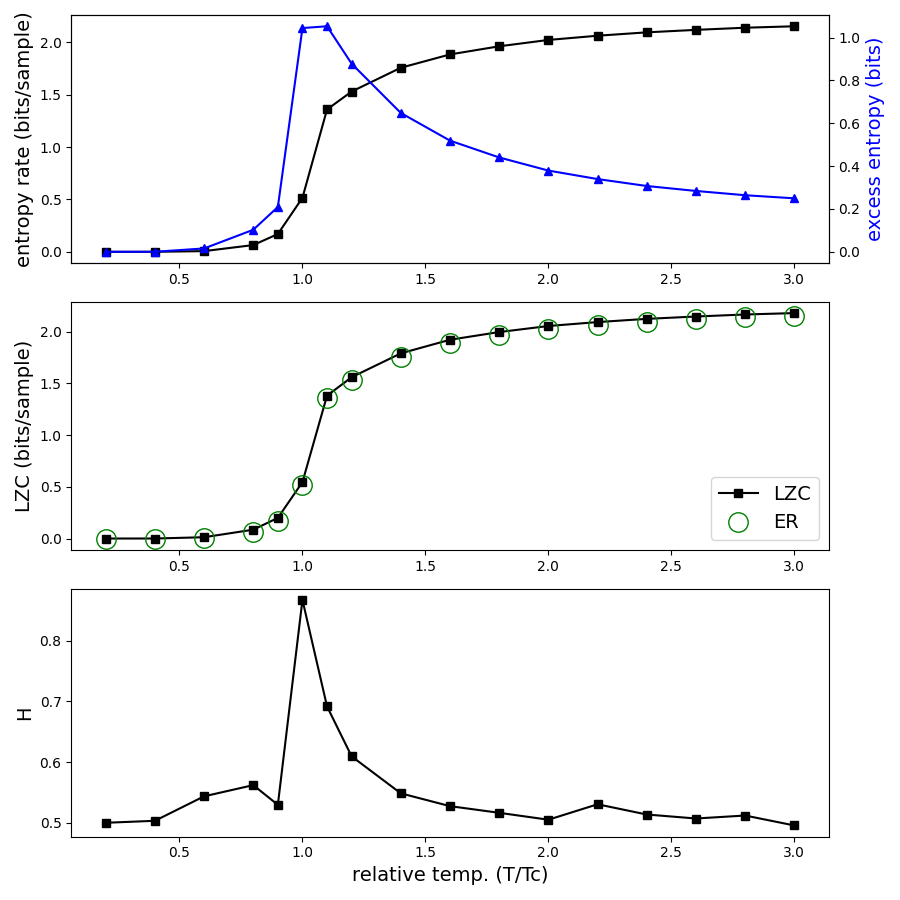

# potts-complexity

The figure below can be reproduced by running the notebook `potts_complexity.ipynb`  

<!--

-->

### Potts 2D visualization
Dynamics of the 2D Potts system (Q=5) on a lattice (128 x 128)  are shown below. The dynamics from the initial random state are included. 

Low temperature, T=0.51 (0.6 Tc)

<video src="videos/Potts2D_Q5_T0.51_L128_N1000.webm" width="256" height="256" controls preload></video>

Critical temperature, T=0.85 (1.0 Tc)

<video src="videos/Potts2D_Q5_T0.85_L128_N1000.webm" width="256" height="256" controls preload></video>

High temperature, T=2.55 (3.0 Tc)

<video src="videos/Potts2D_Q5_T2.55_L128_N1000.webm" width="256" height="256" controls preload></video>

